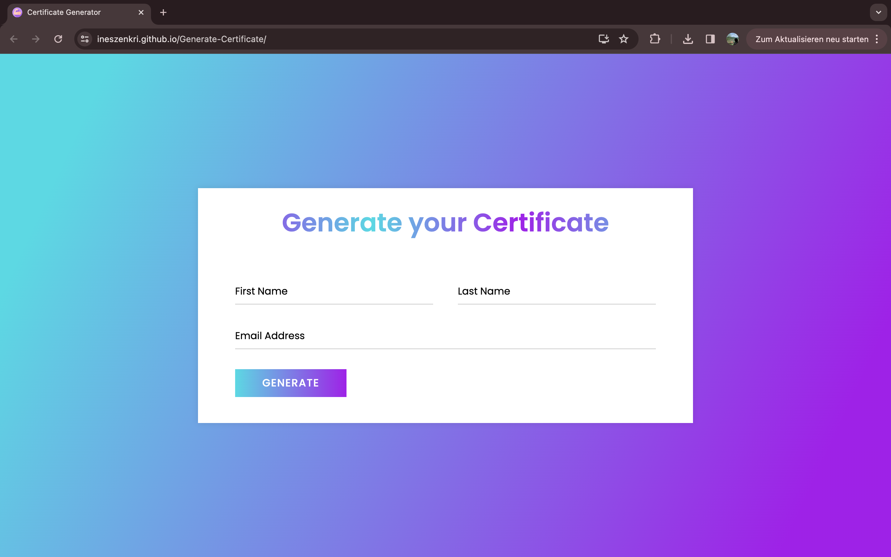
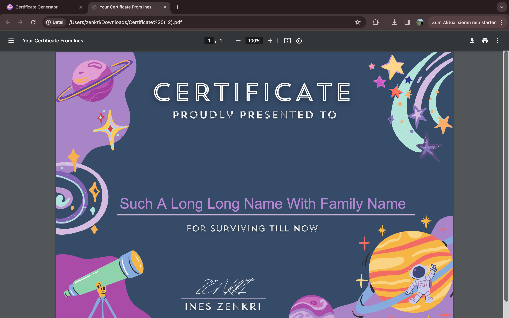
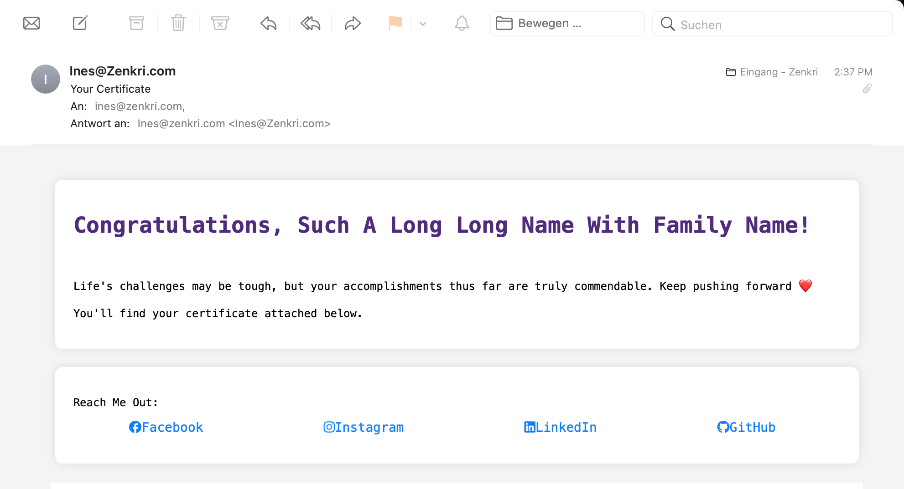

  

<h1 align="center">Certificate Generator </h1>

## Description :

Certificate Generator is a web application that automatically generates, downloads a PDF certificate on the user's device, and sends it to the provided email.

## Technologies Used:

- [Abstract API](https://www.abstractapi.com/api/email-verification-validation-api) for email address verification.
- [SMTP.js](https://smtpjs.com/) for sending emails.

## Features:
- Simple and intuitive interface: 
- - - 
- Handles all names, even super long ones: 
- - -
- Downloadable App: 
- - -
- Sent Through Email: 

## Acknowledgements
- Icons from [www.flaticon.com](https://www.flaticon.com) 🎨

## Contributing
- Contributions are welcome ˶ᵔ ᵕ ᵔ˶ Feel free to [open issues](https://github.com/InesZenkri/Generate-Certificate/issues) or submit[ pull request](https://github.com/InesZenkri/Generate-Certificate/pulls). 🤝

